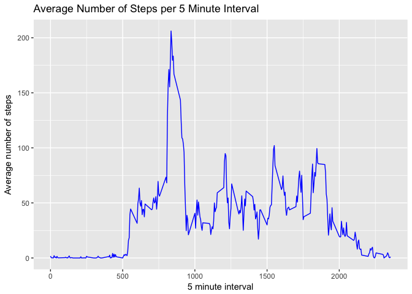
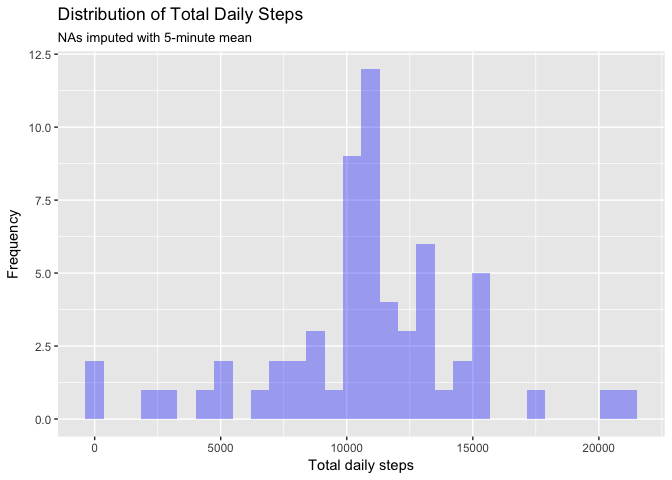

Reproducible Research: Course Project 1
================
Fernando Rodriguez
10/20/2017

### Libraries

I prefer to utilize the *lubridate* package to work with dates, while *dplyr* is my preferred packaged to deal with the data, and it lets me use the pipeline operators, and *ggplot* just looks great in my opinion.

``` r
# To work with dates
library(lubridate)

# To work with data/pipelines
library(dplyr)

# To make beautiful plots
library(ggplot2)
```

### Data

The data is available from [Coursera](https://d396qusza40orc.cloudfront.net/repdata%2Fdata%2Factivity.zip), it is data sourced a personal activity monitoring device. This device collects data at 5 minute intervals through out the day.

The data consists of two months of data from an anonymous individual collected during the months of October and November, 2012 and include the number of steps taken in 5 minute intervals each day.

``` r
url1 <- "https://d396qusza40orc.cloudfront.net/repdata%2Fdata%2Factivity.zip" # Set up quick name for data url
zipfile <- "activity.zip" # Set up quick name for zipfile
download.file(url1, zipfile, method = "curl") # download file, with curl method since I'm on a mac
unzip(zipfile = zipfile, exdir = ".") # Unzip file to directory where the file was downloaded

activity.data <- read.table("activity.csv", sep = ",", header = TRUE) # Read in the data as csv, with headers
```

We explore the data utilizing the head function and also explore the classes to understand any class changes we will need to do.

``` r
head(activity.data) # See the top of the dataset
```

    ##   steps       date interval
    ## 1    NA 2012-10-01        0
    ## 2    NA 2012-10-01        5
    ## 3    NA 2012-10-01       10
    ## 4    NA 2012-10-01       15
    ## 5    NA 2012-10-01       20
    ## 6    NA 2012-10-01       25

``` r
sapply(activity.data, class) # See the column classes
```

    ##     steps      date  interval 
    ## "integer"  "factor" "integer"

The data is made up numerical data for steps and interval and a factor date which will be converted to a date in the year-month-date interval, which can be quickly converted with the *lubridate* function *ymd()*.

``` r
# Use lubridate and pipe operator to mutate date as character into actual dates, and then group dataset by date
activity.data.date <- activity.data %>%
    mutate(date = ymd(date)) %>% 
    group_by(date)
```

    ## Warning: package 'bindrcpp' was built under R version 3.2.5

    ## Warning in as.POSIXlt.POSIXct(x, tz): unknown timezone 'default/America/
    ## Chicago'

### Mean Total Number of Steps Taken per Day

Calculate the total number of steps taken per day.

``` r
# The data is already grouped by date, all we have to do is summarize it by adding up all the steps per day

activity.data.steps <- activity.data.date %>% 
    summarize(steps.day = sum(steps, na.rm = TRUE))

mean.daily.steps <- mean(activity.data.steps$steps.day, na.rm = TRUE) # Find the mean of the daily counts
median.daily.steps <- median(activity.data.steps$steps.day, na.rm = TRUE) # Find the median of the daily counts
```

The mean total number of steps taken per day is 9354, and the median total number of steps taken per day is 10395.

### Average Daily Pattern

Make a time series plot (i.e. 𝚝𝚢𝚙𝚎 = "𝚕") of the 5-minute interval (x-axis) and the average number of steps taken, averaged across all days (y-axis)

``` r
# Here we summarize the data by grouping by interval and finding the mean number of steps taken per interval

activity.data.intervals <- activity.data.date %>% 
    group_by(interval) %>%
    summarize(mean.interval.steps = mean(steps, na.rm = TRUE))

# Setting up the plot
interval.plot <- ggplot(activity.data.intervals, 
                        aes(x = interval, y = mean.interval.steps)) + 
                        geom_line(col = "blue") +
                        xlab("5 minute interval") +
                        ylab("Average number of steps") +
                        ggtitle("Average Number of Steps per 5 Minute Interval")
interval.plot # print out the plot
```



``` r
# Calculating the maximum mean number of steps in an interval
max.interval.steps <- max(activity.data.intervals$mean.interval.steps, na.rm = TRUE)

# Determining the maximum interval number 
max.interval <- activity.data.intervals %>%
    filter(mean.interval.steps == max.interval.steps) %>%
    select(interval)
```

Which 5-minute interval, on average across all the days in the dataset, contains the maximum number of steps?

The interval with the maximum number of steps is inverval 835, with an average of 206.2.

### Imputing Missing Values

Calculate and report the total number of missing values in the dataset (i.e. the total number of rows with NAs) �s)

``` r
missing.finder <- is.na(activity.data.date)

missing.count <- colSums(missing.finder)
missing.values <- max(missing.count)
```

Only the *steps* column has missing values, with a total of 2304 step values missing.

Devise a strategy for filling in all of the missing values in the dataset. The strategy does not need to be sophisticated. For example, you could use the mean/median for that day, or the mean for that 5-minute interval, etc.

Here I have chosen to impute the missing step values with the mean of the 5-minute intervals in an attempt to maintain the granularity of the data, rather than a larger time period.

``` r
# This works by grabbing the clean data, grouping by interval and mutatng the steps column, looking at if it is
# an NA, if it is, then it calculates the mean of the steps in the interval, and if not, leaves it alone
activity.data.impute <- activity.data.date %>% 
    group_by(interval) %>% 
    mutate(steps = ifelse(is.na(steps), 
                          mean(steps, na.rm = TRUE), 
                          steps))
```

With the imputed dateset in hand, make a histogram of the total number of steps taken each day and calculate and report the *mean* and *median* total number of steps taken per day. Do these values differ from the estimates from the first part of the assignment? What is the impact of imputing missing data on the estimates of the total daily number of steps?

``` r
# Here we use the imputed data, group by date, and summarize the total number of daily steps
activity.data.impute.daily <- activity.data.impute %>%
    group_by(date) %>%
    summarize(total.daily.steps = sum(steps, na.rm = TRUE))

# Separate the steps column as a variable
impute.steps <- activity.data.impute.daily$total.daily.steps

# Find the mean & median of the steps variable
mean.impute <- mean(impute.steps, na.rm = TRUE)
median.impute <- median(impute.steps, na.rm = TRUE)

# Set up the plot
impute.daily.hist <- ggplot(activity.data.impute.daily, aes(total.daily.steps)) 
impute.daily.hist + geom_histogram(bins = 30 , alpha = 1/3, fill = "blue") +
    xlab("Total daily steps") +
    ylab("Frequency") +
    ggtitle("Distribution of Total Daily Steps", subtitle = "NAs imputed with 5-minute mean")
```



The data that replaces the NAs in the step column with the median of the 5-minute interval has a daily mean of 1.076610^{4} steps and a median of 1.076610^{4} steps. This is different from just removing the NAs, which produces a mean of 9354, and a median of 10395.

#### Differences in activity patterns between weekdays and weekends

Create a new factor variable in the dataset with two levels – “weekday” and “weekend” indicating whether a given date is a weekday or weekend day.

``` r
# Set up a weekday vector
weekday <- c("Monday", "Tuesday", "Wednesday", "Thursday", "Friday")

# Create a new weekday flag column that determined if the weekday name from the date information is within the weekday vector, if true, it writes "Weekday", if false, it writes "Weekend"

activity.data.impute$weekday.flag <- factor((wday(activity.data.impute$date, 
                                                label = TRUE, abb = FALSE) %in% weekday),
                                                levels = c(FALSE, TRUE), 
                                                labels = c("Weekend", "Weekday"))

# Creates interval summary by weekday flag and interval to find the mean number of steps per interval in weekend and weekday periods

activity.data.impute.interval <- activity.data.impute %>%
    group_by(weekday.flag, interval) %>%
    summarize(mean.interval = mean(steps, na.rm = TRUE))
```

Make a panel plot containing a time series plot (i.e. 𝚝𝚢𝚙𝚎 = "𝚕") of the 5-minute interval (x-axis) and the average number of steps taken, averaged across all weekday days or weekend days (y-axis). See the README file in the GitHub repository to see an example of what this plot should look like using simulated data.

``` r
# Sets up plot to display the weekend and weekday interval data
weekday.plot <- ggplot(activity.data.impute.interval, aes(x = interval, y = mean.interval))
weekday.plot + 
    geom_line() + facet_grid(weekday.flag ~ .) +
    xlab("Interval") +
    ylab("Mean number of steps per interval") +
    ggtitle("Comparison of Weekend and Weekday Activity Patterns", subtitle = "NAs imputed with 5-minute mean")
```


There are different patterns between weekday and weekends. For example, activity seems to start later in the weekend, while activity seems to be sustained at a higher level during the weekend on an interval basis than on the weekdays. We also see an longer activity period later in the intervals for the weekends. Generally, weekday numbers show a "lull" in the middle of the day, probably related to being at work.
